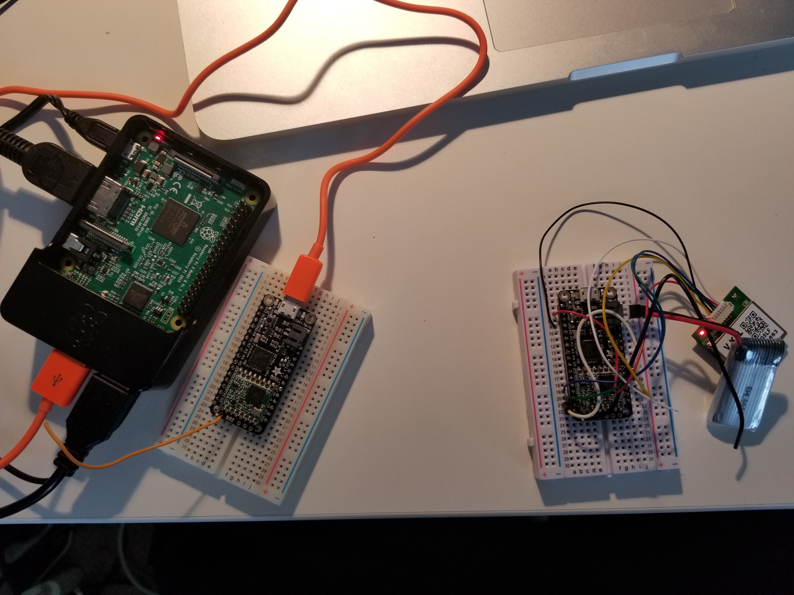
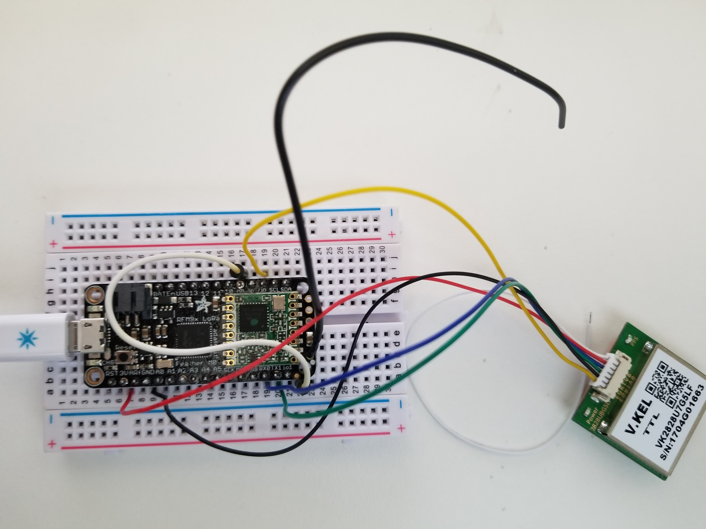
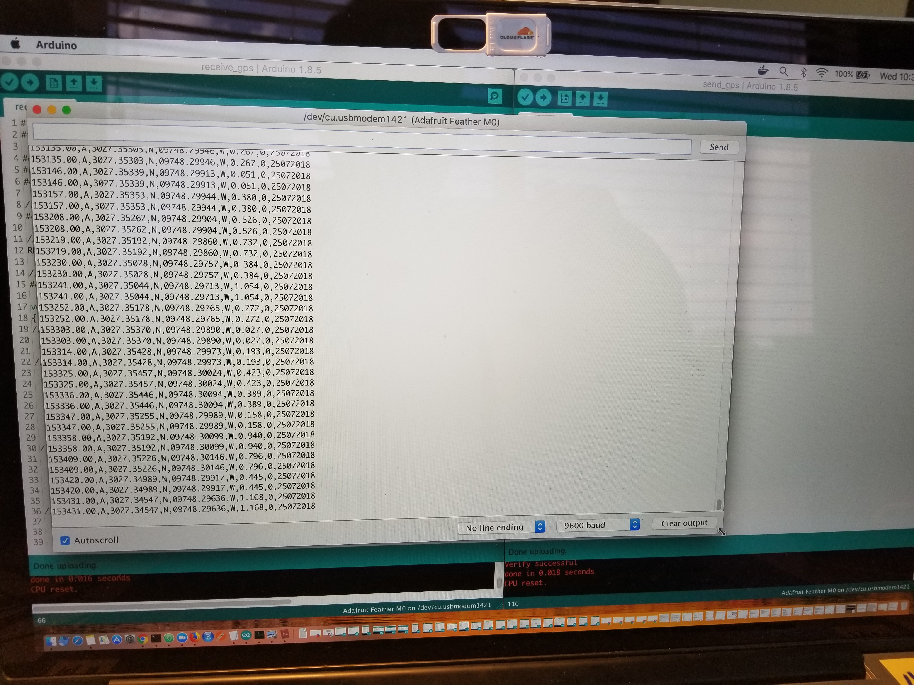
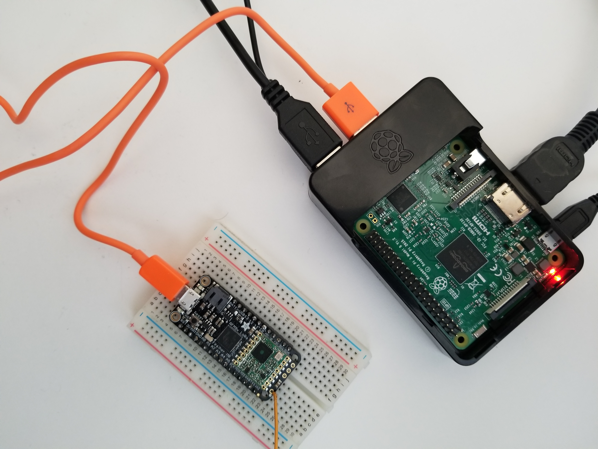

# Hardware components needed for this project

* Adafruit Feather M0 with RFM95 LoRa Radio (2)
* Raspberry Pi 3 with adapter (1)
* GPS module - V.KEL TTL VK2828U7G5LF (1)
* _Optional_ - 3.7v 350mAh LiPo battery (2)

## Tools & software needed for this project

* Soldering iron
* Terminal (Raspberry Pi 3)
* Arduino IDE (For more details, click [here](https://learn.adafruit.com/adafruit-feather-32u4-basic-proto/using-with-arduino-ide)):

  1 - Go to `Arduino -> Preferences` and copy/paste `https://adafruit.github.io/arduino-board-index/package_adafruit_index.json` at `Additional Boards Manager URLs` then click `OK`

  2 - Go to `Tools -> Board: "Adafruit Feather M0" -> Boards Manager...` then:
    * Type `Arduino SAMD` in the top search bar, then when you see the entry, click `Install`
    * Type `Adafruit SAMD` in the top search bar, then when you see the entry, click `Install`
    * For Windows users only, install drivers from [here](https://github.com/adafruit/Adafruit_Windows_Drivers/releases/tag/2.3.0)

## Setup Steps

### A - LoRa with GPS as Sender

* Solder a wire as the antenna
* Wire the gps module as the following (wiring from gps to LoRa):
  - `TX -> RX`
  - `RX -> TX`
  - `EN -> 5`
  - `VCC -> 3V`
  - `GND -> GND`
* Wire `io1 -> 9` on LoRa
* Plug the LoRa receiver to laptop and identify its port on Arduino IDE to push the code to the intended LoRa
* Open the `Serial Monitor` from the top right side of the Arduino IDE for debugging

> This is the Serial Monitor from Arduino IDE that shows the connection, the topics, the message, etc.

### B - LoRa Receiver

* Solder a wire as the antenna
* Plug the LoRa receiver to laptop and identify its port on Arduino IDE to push the code to the intended LoRa

### C - Raspberry Pi

* Plug in to USB ports:

  1 - Keyboard

  2 - Mouse
  
  3 - LoRa Receiver (Unplug it from laptop to Raspberry Pi 3)

* Plug in to HDMI port:

  1 - Screen/Monitor

* Plug the power and make sure that the Raspberry Pi 3 is up and ready for use

* Open a terminal on Raspberry Pi 3 to:

  1 - First install pip:

      `sudo apt-get install python-pip`

  2 - After that install pyserial:

      `sudo pip install pyserial`

	3 - Then:

      `sudo pip install paho-mqtt

    	sudo git clone https://github.com/eclipse/paho.mqtt.python.git

    	sudo cd paho.mqtt.python

    	sudo python setup.py install`

  4 - Run gateway code:

      `sudo git clone https://github.com/hovig/lora_to_lora_mqtt_iot_cloud.git

      sudo cd lora_to_lora_mqtt_iot_cloud

      sudo python lora_mqtt_iotf.py`

