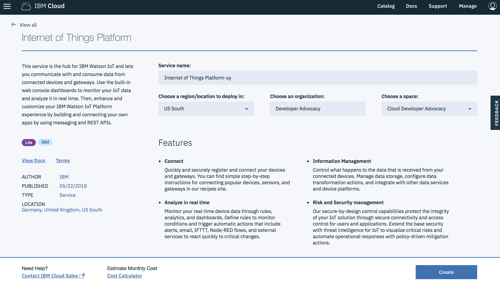
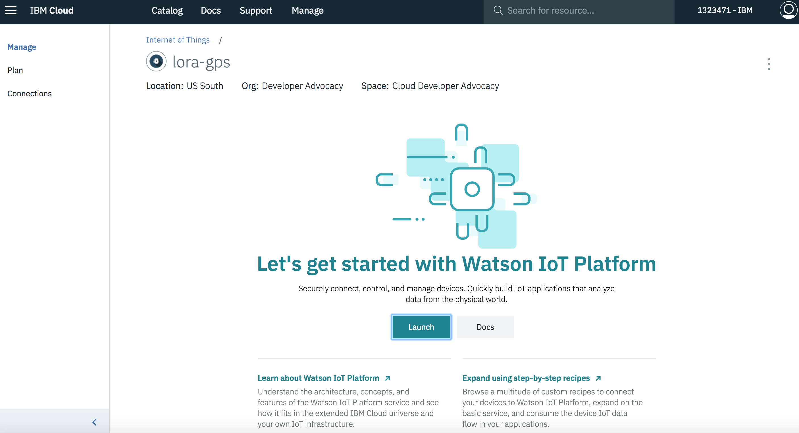
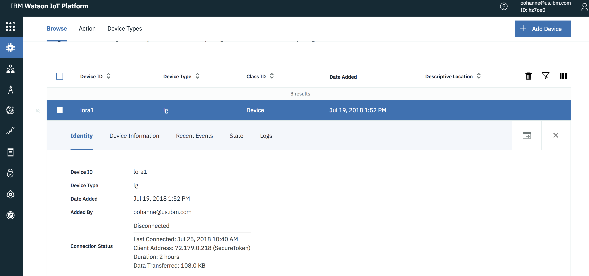

# Internet of Things Platform

The Watson IoT Platform will play multiple roles in this pattern, by taking in the audio and delivering it back, and by sending commands and receiving topics from a hardware device. The published topic will carry out a sentence with it based on a previously sent command. MQTT made it easy to build a communication between the Node-RED, IoT Platform and the device.

### Open IBM Cloud Service Catalog:

> [IoT Platform service (not boilerplate) catalog](https://console.bluemix.net/catalog/services/internet-of-things-platform)

After you create the service, open the IoT Platform service and click Launch button:

### How-To:

> Click here to [generate API key and token in IBM Watson IoT Platform](https://developer.ibm.com/code/howtos/iot-generate-apikey-apitoken)

### Device Created on Watson IoT Platform:

