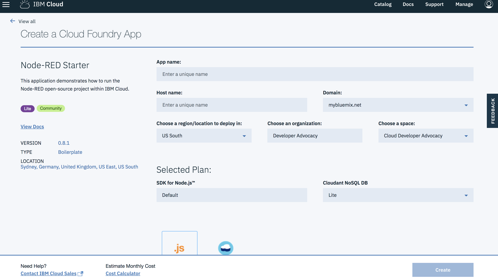
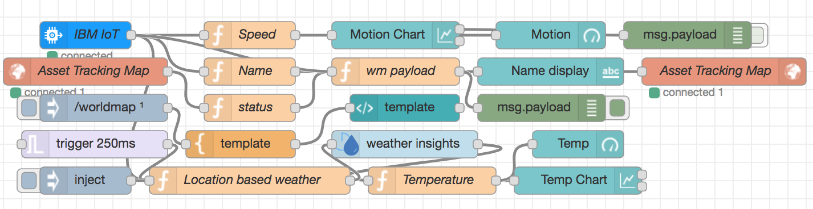
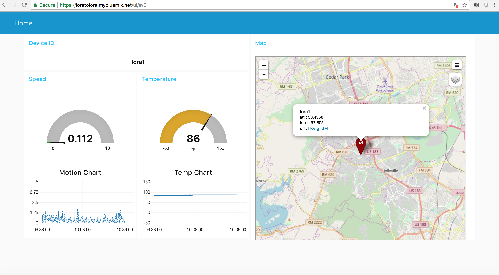
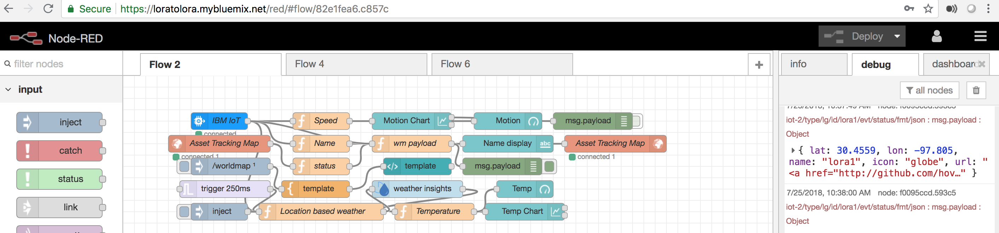

# Node-RED Starter

### Open IBM Cloud Service Catalog:

> [Click to create the Node-RED boilerplate starter](https://console.bluemix.net/catalog/starters/node-red-starter).

* Click on the `Visit App URL`
* Open the Node-RED editor and setup your own `username` and `password`
* On the top right side of the editor, click on: `Burger Menu` -> `Import` -> `Clipboard`
* Copy the code from the [scripts/flow.json](scripts/flow.json) in Github
* Paste the code in the `Clipboard` in the Node-RED editor

### Important Notes that are needed for the service nodes in Node-RED editor:

* Copy and paste into one place all usernames, passwords and hosts of all services for easy access when needed
* `These credentials will be used in the Node-RED editor for each service node, without them your app will not behave as intended in this tutorial`
* Each service will automatically create its credentials: `Username` and `Password`
* If you don't see the service credentials, you can create a new one: `Create Credentials`
* Internet of Things Platform will require to create an `api key` and `api token`. There's an how-to guide included on [IoT page](steps/iot.md#how-to).
* For the missing nodes (dashed), click on: `Burger Menu` -> `Manage Palette` -> `Install`
   Then, type in the search field (search modules) to install the `worldmap` and `bluemix-dashboard`

> Node-RED code with debug

